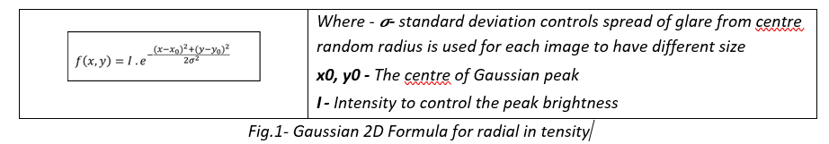
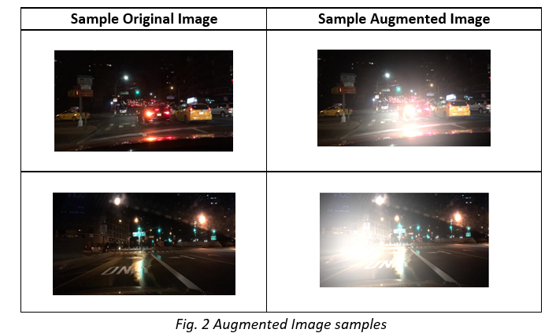
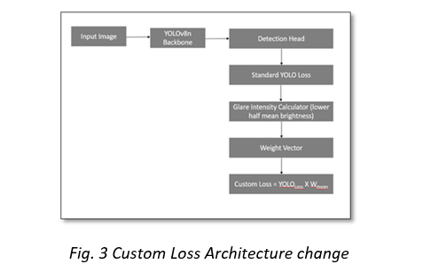
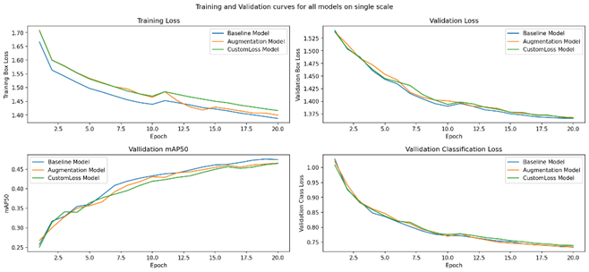
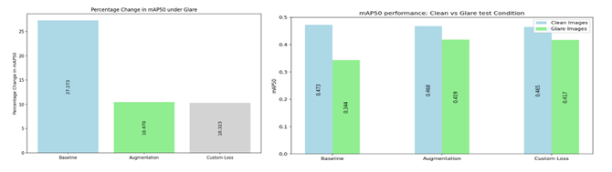
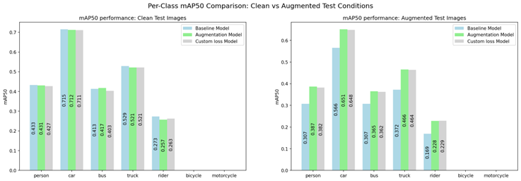
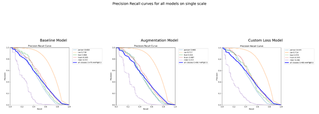
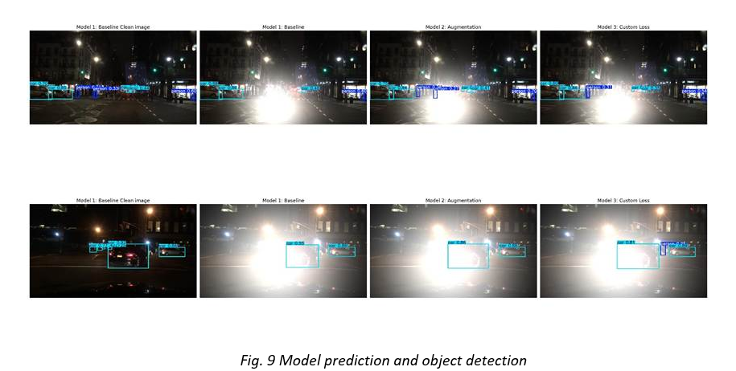

# YOLO_Robustness_study_to_Glare

# Introduction
Autonomous vehicle (AV) is gaining a lot of momentum with almost all the automobile manufacturers
investing huge resources to develop and optimise it. Even with many real-worlds vehicles deployed by
various companies, achieving reliability and safety is still a challenge which industry is working to resolve. For
the autonomous vehicles to reliably detect objects cameras must be able to operate accurately in varied
environmental and lighting conditions. Exposure adjustment plays an important role for performance of
perception systems used in autonomous vehicles as poorly managed exposure can lead to performance
degradation [ 1 ]. The glare produced by oncoming vehicle headlight can cause temporary camera blindness
causing drop in detection performance [ 2 ]. The problem is further increased at nighttime when sudden
changes to lighting are more frequent and severe. Glare is caused when light is reflected, diffracted and
refracted by the particles in atmosphere as well as the elements of lens used in the camera. When light falls
on the lens, these reflections cause occlusion and degrades the image quality overall [ 3 ].

Autonomous vehicles use two stage system, the hardware itself including camera and sensors like LiDAR and
the software that processes data in real time and makes decisions using deep neural network. In this
experimental analysis, we propose to use software approach where we study the robustness of YOLOv
object detection model specifically to the nighttime driving scenario by augmenting 25% of training images
to have random glare representing similar to that produced by headlights of oncoming vehicle. We evaluate
performance of model in 3 controlled experiments. First the baseline is obtained using nighttime images.
Second, an artificial glare is applied using 2D Gaussian function to the 25% of original images in training
dataset to simulate the real-world conditions. In the final experiment, a custom weighted loss function is
applied by extending YOLOv8 architecture that penalises loss based on intensity of glare in images.

Industry trend for achieving camera only autonomous driving systems is increasing, where the robustness to
noise such as glare, fog becomes important. We aim to study “ If training time glare augmentation and
inclusion custom weighted loss function improve robustness (mAP50) compared to unaugment baseline ”. This
study is also personally motivated by driving conditions in developing countries, where there are many
poorly lit single lane roads and usage of high beam lights is common that causes severe glare. These
conditions are underrepresented in autonomous driving training datasets. Glare not only presents challenges
to human drivers but also to the camera-based perception systems. It is also interesting as this helps to know
what change impacts the model performance by isolating the impact of augmentation and custom loss
function on object detection through controlled comparison.

# Design and Methodology
# Design of Mathematics for Augmentation and the Custom Loss function
## Augmentation

BDD100K has images of nighttime driving scenes, but a limited number of images having a natural glare. As
obtaining glare images in different environments is difficult within a short time and is not feasible, we plan to
use artificial augmentation. In the real-world driving environments, the intense direct light from headlight of
vehicle produces camera lens glare that is normally radial in shape with highest intensity at the centre and
reduces radially towards its circumference as shown in [ 6 ]. For this study, we are using a simplified 2D-
Gaussian function which captures the radial characteristics of glare like real world scenarios. The simulated
glare f(x,y) at any pixel location (x,y) in an image is given by

  

 

We planned to mimic the real-world scenario by restricting the placement of glare centre (x 0 , y 0 ) to be
between 50-90% of the height of image in bottom half as this is realistic position of headlight from oncoming
vehicles, with a variable peak intensity of 0.7-1.2 for each image intentionally set high of 1.2 to produce
extreme glare cases as observed. We used white overlay as the recent models of vehicles are fitted with
white LEDs for headlights. In order to avoid the YOLOv8 model learning the glare as a fixed spatial noise, the
horizontal position along the width is also varied for each image between 20-80% of image width.

  
  

Custom Loss

The standard loss function of YOLO applies a constant penalty to all the training images treating the clean
and augmented images with the same weight. In order to have higher penalty for failing to detect
augmented images, this custom loss function is used. We use the same YOLO architecture and inject weight
to the loss component [Fig. 3]

  

The custom loss function uses the brightness intensity of image to dynamically scale the loss penalty.
Intensity is calculated in bottom half of all images similar to how artificial glare is applied. After running
experiments on sample images, we fixed and applied a linear scaling transformation using a predefined
parameter set at α=2.0. The specific weight vector for each image is then calculated using

  Wi = 1.0 + (α * mean_glare_intensity)

During the forward pass, these images are mapped to the bounding boxes loss calculation. The standard
YOLO loss is calculated using the default YOLO loss function and finally the batch loss is multiplied by the
mean of target weights for the entire batch without altering the feature extraction. Thereby if batch has
augmented image and the object is not detected, the mean weight will be higher that makes sure to penalise
the misclassification for batches containing glare with higher loss penalty.

  Loss custom = Loss yolo * W mean

# Methodology- Coding Algorithm
We employed standard machine learning for computer vision pipeline to train and evaluate. In order to have
reproducibility and to have a controlled experimental setup, the process was split into two steps

*Preprocessing*: This is a one-time activity that is performed at the start of experiment which involves
steps to download, pre-process, filter the images, convert the labels to YOLO readable format, apply
augmentation, save and store it persistently to be reused across all the experiment.

*Model Training and Evaluation*: This has the main steps of implementation of the training and
evaluation pipeline.

The code was initially developed by me on T4 GPU version of Colab Free tier and assistance from Generative
AI was used to support debugging errors especially on the custom loss function to resolve device consistency
issues between CPU and CUDA tensors experienced during validation. Assistance was also used to optimise
the code to improve the performance of the augmentation function.

### Preprocessing

The original BDD100K dataset was passed to a preprocessing pipeline which first filtered to have nighttime
images with chosen 7 critical classes- Person, car, truck, bus, rider, bicycle, motorcycle [ 5 ] and convert the
JSON labels to text bounding-box based YOLO readable text format required by YOLO architecture having
normalised coordinate boxes [centre_x, centre_y, w, h]. This subset is used as a baseline for the comparison.
The original dataset from UC Berkeley is already divided into train, validation, and test splits in 70:10:20 ratio
with labels available for all the splits. This preprocessing step is applied to all the folders to standardise the
dataset across. After the filtering, the filtered subset used for analysis consists of 28028 images in the train
folder, 3929 images in validation, and 8036 images in the test set. The filtered subset has the similarly 70%
train, 10% validation and 20% test ratio maintained with the same class imbalance for most vulnerable
classes having low representation as in original dataset. This validation was essential to have a proper
comparison with benchmark and ratio splits has no or less effect on the performance.

The second step in preprocessing is application of glare as offline photometric image augmentation altering
adding bright white overlay. This is applied only to training dataset and the validation dataset is intentionally
kept 100% clean and not augmented to avoid model learning the artificial glare as a feature thereby keeping
baseline features retained during training and avoid overfitting. To isolate and study the impact, we applied
the 2D-Gaussian radial synthetic glare augmentation on randomly selected 25% of training images by
experimenting on small dataset as shown in study [ 8 ]. To avoid uncertainty attributed to additional images ,
we replaced the original images with augmented images in training, keeping the dataset size constant
across all the experiments. To evaluate generalisation and robustness of model, we created two testing
environments , a clean test set and 100% augmented test image in a separate folder. This helps to evaluate

both extreme of how model performs on clean and fully augmented images in the report. All images and
labels for experiments are kept in separate folders stored persistently on google drive for reproducibility.

### Model Training and Evaluation

We trained three independent models with controlled experimental conditions to isolate and evaluate
individual contribution of each experimental variable [Fig. 4]. The first model (M1) was trained on the
original filtered subset of nighttime images without any augmentation. This serves as a baseline and is used
as a reference to compare the mAP50 of standard YOLO model from the experiment by Sun et al. [ 10 ]. The
second model (M2) was trained on a dataset having 25% glare augmented images for training with standard
YOLOv8 loss function. For the third model (M3), we extended the second model by replacing the standard
YOLOv8 loss function with custom weighted loss to evaluate if penalising the augmented images helps to
improve robustness.

We used YOLOv8n as the base architecture. The model has small lightweight parameters that is suitable to
run on the resource constrained environments where GPU availability is restricted. We conducted the
experiment using standard YOLO settings for training so as to keep the models comparable with standard
model using “ auto ” optimiser the model selected learning rate of 0.0 000909 and momentum of 0.
automatically during all training overriding default lr0 and momentum settings. We used the YOLO’s inbuilt
“ Letterboxing ” technique to resize images to 640X640. This helped us to maintain the aspect ratio of original
image while reducing image size. This was specifically chosen as smaller image size would mean more harder
to find small vulnerable road object classes like pedestrians, rider. We tested several configurations on
sample dataset manually finding the hyperparameter- batch size and number of workers with different
options on Colab and finally set it to 16 and 2 respectively which was maximum feasible on Colab for this
dataset. We did not include other explicit hyperparameters apart from these to isolate the effect of each
change being studied in this experimental setup.

We trained all the 3 models for 20 epochs and evaluated two sets of test images – clean images and 100%
augmented images to study the generalisation and robustness. The model showed potential for further
improvement in performance, however, due to resource constraint on the Colab, the limited GPU availability
limited us from training further. We monitored training curves and models showed signs of convergence
showing that epoch limit did not impact the results significantly. We evaluated the performance of models
based on detection using precision, recall and mean average precision at intersection over union threshold of
50 (mAP50). We also used the box loss and precision-recall curve to evaluate all the models.

# Results
The result of mAP50, precision, and recall for the three different models on clean and glare test dataset.

  
  
  | Model | Test dataset | mAP50 | Precision | Recall |
  | :--- | :--- | :--- | :--- | :--- |
  | **Baseline (M1)** | Clean | 0.473 | 0.615 | 0.418 |
  | **Baseline (M1)** | Glare | 0.344 | 0.518 | 0.332 |
  | **Augmentation (M2)** | Clean | 0.468 | 0.61 | 0.419 |
  | **Augmentation (M2)** | Glare | 0.419 | 0.573 | 0.382 |
  | **Custom Loss (M3)** | Clean | 0.465 | 0.595 | 0.424 |
  | **Custom Loss (M3)** | Glare | 0.417 | 0.577 | 0.383 |
  
  *Table 2: Performance metrics across 3 models*

We observed 1% training-accuracy tradeoff on clean images showing that replacing 25% of clean images with glare augmented images during training has not induced catastrophic forgetting on clean images. We see that on clean images, the precision is reduced by 0.8% for M2 when compared to M1 and 3.25% for M3 which is expected due to harder glare augmented images and custom loss function respectively. However, models M2 and M3 (M3>M2>M1) show improvement of over 1% in recall when compared to M1 suggesting they got better at detecting objects. We observe that the precision and recall for glare augmented test images improved for M2 and M3 compared to M1 showing that the training time augmentation helped in overall improvement in performance of model and custom loss model is prioritising the detection sensitivity. Compared to M2, precision and recall for M3 is marginally increased (Precision: 0.573 vs 0.577, Recall: 0.382 vs 0.383) suggesting that even with a decrease in mAP50 custom loss helps to predict right and improve sensitivity over all models. It also suggests that further training for more than 20 epochs could show the higher deviation between M2 and M3. A comparable study [10] used changes to YOLOv8 on full BDD100K dataset using same 7 classes trained for 100 epochs, reported baseline model mAP50 of 0.520. Our baseline achieved 0.473 on night only dataset a difference that is expected for being trained on harder nighttime conditions, reconfirming that the 20 epochs were sufficient to obtain a good baseline for this analysis.

  
  
  
  *Fig. 5 Loss and mAP50 curves*

From the training curve for the 20 epochs [Fig. 5] we observe steady approaching convergence with no signs of overfitting and training box loss is close to each other and validation box loss curve almost overlapping each other. The training box loss for M1 is slightly lower than that of M2 and M3, which is expected considering they were trained on harder sets of glare augmented images and the validation box loss is almost overlapping. We observed that the mAP50 curve is consistently improving with no model plateauing at the end of 20 epochs. This suggests that it could further improve with a greater number of epochs provided with no hardware constraints.

  
  
  
  *Percentage change in mAP50 on glare test images*

Testing on glare augmented images we observed, the mAP50 of baseline model dropped significantly by 27.3% from 0.473 to 0.344. The augmented model M2 and custom loss model M3 show reduced degradation to 10.5% and 10.3% respectively, showing that the training time augmentation helped improve the robustness of model to glare [Fig. 6]. 

  
  
  
  *Per-class mAP50 across both test dataset*

We observe that on the clean images all the 3 models performed similarly across the class with the car object achieving the highest mAP50 of ~0.71. On the augmented test images, we see a significant improvement in model M2 and M3 for person, rider and truck classes when compared to M1. We do not have representations for bicycles and motorcycles which is known as the dataset is imbalanced with these classes underrepresented [5]. The similar performance on clean images proves the training time augmentation of only training has not degraded performance on clean glare free images.

The precision-recall curve [Fig. 8] confirms the above findings, and we observe that the car class is strongest and rider is the weakest class which is consistent with the class imbalance in the filtered subset. 

  
  

# Qualitative Result

  
  

The figure [Fig. 9] shows 2 examples of prediction from the trained models compared side-by-side. To have a clear comparison, the images are arranged as M1 on clean image, M1 on augmented test image, M2 on augmented test image, M3 on augmented test image respectively. In first image we see how predictions missed by baseline model M1 on augmented test image failing to detect a lot of objects including the pedestrian crossing the road which was recovered and detected by M2 and M3. From the second image we observe that all the models miss a significant number of car objects but M3 detects person having low representation in imbalanced dataset that was completely missed by all other models including the M1 on clean image. This is in line with findings above that M3 has higher recall and precision over M1 and M2 on both clean and augmented images. This suggests that further investigation with more training is required provided hardware constraints are resolved to know the effect of M3 on a larger scale. This suggests that training time variations is important for a model to generalise and to be robust. 

# Ethical Considerations for deployment and robustness

Autonomous vehicles are rapidly growing with a significant number of cars already deployed and sold by automobile companies. This idea is extending to other types of vehicles including trucks, buses, and other vehicle classes. With deep neural network driving the decision-making, ethical implications of this study must be carefully considered. United Kingdom government also has listed ethical recommendations to consider in their official website [11].
One of the important factors is the quality of training data and the bias it introduces during training that impacts decision-making. The models used should be trained appropriately with the conditions, uniformly distributed object classes to learn the appropriate decision-making patterns to a particular local environment. The model trained on dataset with left-hand-right-lane driving scenarios may turn in a wrong direction when it must take evasive action. Or if model is trained on dataset having lower representations of children crossing roads or only trained on well-developed highway roads, tend to be biased towards it and fail while driving near children's play area and on low-lit single country-side roads and can lead to a big loss. In the study we used a dataset which is predominantly captured in the US which ideally brings bias on the driving side and the infrastructure. Additionally, it has lower representation of vulnerable classes like pedestrians and children. Hence, we should be cautious to handle them before deploying and use local, balanced datasets suitable to environment they are planned to be deployed. Different variations with local environmental inclusion would benefit the model to be robust to changes.
Another factor to consider which is also mentioned in UK guidelines is when an unavoidable collision scenario occurs it raises questions on accountability, liability and ability of model to construct decision-making process it took. The algorithmic decision-making is not in scope of this study but is an important consideration before deployment. 
Data privacy is another important point to consider also mentioned in UK recommendations. As the camera-based perception system continuously captures footage in public places, following the guidelines the data should be handled keeping privacy of people recorded including anonymisation of individuals where required.
The results obtained can be used for wider research and development to extend it to train and deploy. In our study a false negative, failing to detect a rider or pedestrian under glare conditions could have a life-threatening consequence on deployment showing the importance of prioritising recall for vulnerable road user classes, which was seen in the model using custom loss function. We need to also consider other ethical considerations as listed above before extending this study and using it in production systems.

# Conclusion

The study we performed was to evaluate the robustness of object detection using the YOLOv8 model to nighttime glare augmented images. We conducted experiments of 3 different models- baseline, augmentation aware, and custom loss model across clean and augmented test images. From the result, it could be inferred that introduction of augmented images in training had less impact on models performance on clean images showing that the 25% augmentation only in training set strategy helped model in generalisation. On the augmented images, we observed that the baseline model performs significantly lower (27.3%) whereas the both glare aware model and custom loss model showed lower degradation (~10%). This shows that training time augmentation can be used as one of the effective and computationally low-cost strategy to improve robustness without the need for hardware modifications or architectural changes which are predominantly used and researched currently.
The introduction of custom loss function showed marginal benefit over the augmentation aware model, but we observed that it captured vulnerable road user classes like rider, pedestrians behind the glare that were missed by the other models on many occasions. The small difference shown in performance could be limited by the number of epochs trained, where additional epochs could have had more influence on the learning. This suggests that the weighted loss approach with training time augmentation may be more beneficial for safety of vulnerable road users even with marginal overall improvement of mAP50. We observed good convergence across all 3 models over 20 epochs, though none fully plateaued, suggesting further training could improve performance gain. 
The future work on this could be done to extend the training to a greater number of epochs, considering images having glare representation from real-world scenarios and also to extend it to handling the glare from the sun in morning driving scenarios. This study showed evidence that synthetic glare augmentation is helpful training strategy for improving nighttime object detection and the weighted loss helps improve recall for object detection having glare and is relevant considering the industry trend to move towards camera-only autonomous driving systems deployed in real-world scenario.

References 
[1] Learning to Control Camera Exposure via Reinforcement Learning, Kyunghyun Lee and Ukcheol Shin and Byeong-Uk Lee, 2024, https://arxiv.org/abs/2404.01636

[2] How to deal with glare for improved perception of Autonomous Vehicles, Muhammad Z. Alam and Zeeshan Kaleem and Sousso Kelouwani. 2024. https://arxiv.org/abs/2404.10992

[3] Practical assessment of veiling glare in camera lens system, Ivana Tomić, Igor Karlović, Ivana Jurič. 2014. https://pdfs.semanticscholar.org/d49f/7457e84f42ab583ffa83f342bed723440191.pdf 

[4] Getting to know low-light images with the Exclusively Dark dataset. Computer Vision and Image Understanding. Loh, Yuen Peng & Chan, Chee Seng. 2018. https://arxiv.org/pdf/1805.11227

[5] BDD100K: A Diverse Driving Dataset for Heterogeneous Multitask Learning. Yu, Fisher & Chen, Haofeng & Xian, Wenqi & Chen, Yingying & Liu, Fangchen & Madhavan, Vashisht & Darrell, Trevor. 2020. https://arxiv.org/pdf/1805.04687. Dataset link http://bdd-data.berkeley.edu/download.html 

[6] Data-Driven Headlight Flare Model for Automative Cameras BODA. Li, Hetian Wang, Yiting Wang, Pak Hung Chan, Darryl Perks and Valentina Donzella. 2025. https://ieeexplore.ieee.org/document/11134042

[7] Benchmarking Neural Network Robustness to Common Corruptions and Perturbations. Hendrycks, Dan and Thomas G. Dietterich. 2019. https://arxiv.org/pdf/1903.12261

[8] Importance of Adaptive Photometric Augmentation for Different Convolutional Neural Network. Saraswathi Sivamani, Sun Il Chon, Do Yeon Choi, Dong Hoon Lee, Ji Hwan Park. 2022. https://doi.org/10.32604/cmc.2022.026759

[9] Learning to Reweight Examples for Robust Deep Learning, Mengye Ren and Wenyuan Zeng and Bin Yang and Raquel Urtasun. 2019. https://arxiv.org/abs/1803.09050

[10] PyQt5-powered frontend for advanced YOLOv8 vehicle detection in challenging backgrounds. Sun, Fucai and Du, Liping and Dai, Yantao. 2025. https://doi.org/10.1049/wss2.70001

[11] https://www.gov.uk/government/publications/responsible-innovation-in-self-driving-vehicles/responsible-innovation-in-self-driving-vehicles

[12] Geiger, A., Lenz, P., & Urtasun, R. (2012). Are we ready for autonomous driving? The KITTI vision benchmark suite. 2012. https://www.cvlibs.net/datasets/kitti/

[13] Focal Loss for Dense Object Detection. Lin, Tsung-Yi & Goyal, Priyal & Girshick, Ross & He, Kaiming & Dollar, Piotr. 2018. https://arxiv.org/pdf/1708.02002
